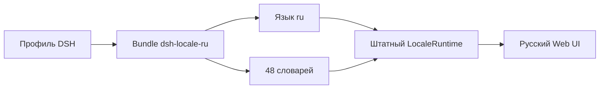

# 🇷🇺 dsh-locale-ru

### Нативная русская локализация веб-интерфейса DeepSeek Harness

> **Форк mskproger/dsh-locale-ru.** Обновлён под DeepSeek Harness **0.2.0-rc.2**: добавлены недостающие
> ключи всех 50 словарей (включая статусы работы агента `message.stepProcess.*` — «Чтение файлов»,
> «Запись файлов» и т.д.) и два новых словаря — `schedule.manager` и `voice-input`.
> Основан на [AbsoluteMikhail/dsh-locale-ru](https://github.com/AbsoluteMikhail/dsh-locale-ru) (MIT).

[](LICENSE)
[](https://github.com/deepseek-ai/deepseek-harness)
[](https://github.com/AbsoluteMikhail/dsh-locale-ru/actions/workflows/check.yml)

[English](README.en.md)

`dsh-locale-ru` добавляет язык **Русский** в штатный переключатель DeepSeek Harness и переводит основные поверхности веб-интерфейса. Пакет использует публичный API языковых пакетов, не подменяет внутренние методы приложения и не изменяет DOM после отрисовки.

**Автор и сопровождающий:** [AbsoluteMikhail](https://github.com/AbsoluteMikhail)

## Возможности

- 50 пространств перевода и более 2300 строк интерфейса.
- Чат, настройки, рабочие области, плагины, разрешения, терминал, файлы, планы, задания, субагенты и служебные панели.
- Мгновенное переключение языка через **Настройки → Общие настройки → Язык**.
- Сохранение выбранного языка в штатных настройках профиля.
- Русские формы числительных: `1 вызов`, `2 вызова`, `5 вызовов`, `21 вызов`.
- Английский fallback для ключей сторонних плагинов, которых ещё нет в русском словаре.
- Локализованные названия встроенных режимов доступа.
- Автоматическая сверка ключей и плейсхолдеров с совместимой версией Harness.
- Установочный smoke-тест на изолированном реальном профиле `web`.



## Установка

### Из GitHub

```sh
dsh plugin --profile web add github:AbsoluteMikhail/dsh-locale-ru
```

Собранные файлы `lib/` хранятся в репозитории. Установка из GitHub не запускает сборочный код на компьютере пользователя и не требует разрешать install-скрипты.

После установки перезапустите профиль, откройте **Настройки → Общие настройки → Язык** и выберите **Русский**.

### Из npm

Команда станет доступна после публикации пакета `@absolutemikhail/dsh-locale-ru`:

```sh
dsh plugin --profile web add @absolutemikhail/dsh-locale-ru
```

### Через интерфейс

Откройте **Плагины → Добавить плагин** и вставьте:

```text
github:AbsoluteMikhail/dsh-locale-ru
```

## Проверка установки

```sh
dsh --profile web --dump-config
```

В собранной конфигурации должен появиться ряд:

```yaml
- id: locale-ru
  name: '@absolutemikhail/dsh-locale-ru'
```

## Что переводится

| Раздел | Примеры |
|---|---|
| Общий интерфейс | Кнопки, ошибки, загрузка, подтверждения |
| Чат | Сообщения, статистика, использование токенов, история |
| Настройки | Язык, тема, модели, плагины, архив сессий |
| Рабочие области | Сессии, файлы, ветвление, выбор папки |
| Инструменты | Команды, планы, цели, навыки, задания |
| Агенты | Субагенты, команда агентов, пресеты |
| Боковые панели | Браузер, терминал, файлы, документы |
| Документы | Markdown, HTML, PDF, изображения, Office |

Сторонний плагин со своим пространством перевода продолжит работать: неизвестные русскому пакету ключи отображаются на английском через штатную цепочку fallback.

## Русские числительные

В словарях предусмотрены категории CLDR `one`, `few`, `many` и `other`. Версии Harness с расширенной поддержкой числительных автоматически выбирают правильную форму по параметру `count` или `n`.

| Число | Результат |
|---:|---|
| 1 | 1 вызов инструмента |
| 2 | 2 вызова инструмента |
| 5 | 5 вызовов инструментов |
| 21 | 21 вызов инструмента |

## Совместимость

Первая версия подготовлена для DeepSeek Harness `0.1.6-alpha.2`; этот форк обновлён под `0.2.0-rc.2` и использует публичные методы `addLanguage` и `register`. Словари соответствуют интерфейсным ключам этой версии Harness.

Расширенные категории `.few` и `.many` требуют версии `LocaleRuntime` с поддержкой CLDR. На более ранних версиях остальные переводы работают через стандартные ключи `.one` и `.other`.

При обновлении Harness состав ключей может измениться. Выпуск новой совместимой версии русификатора должен сопровождать такие изменения.

## Обновление и удаление

```sh
dsh plugin --profile web update @absolutemikhail/dsh-locale-ru
dsh plugin --profile web remove @absolutemikhail/dsh-locale-ru
```

Для GitHub-установки можно закрепить конкретный тег:

```sh
dsh plugin --profile web add github:AbsoluteMikhail/dsh-locale-ru#v0.1.0
```

## Разработка

Словари находятся в [`src/client/dictionaries`](src/client/dictionaries), регистрация языка — в [`src/client/index.ts`](src/client/index.ts), установочный слой — в [`cordis.patch.yml`](cordis.patch.yml).

```sh
pnpm install
pnpm run check
```

`pnpm run check` выполняет сборку, проверяет регистрацию всех 48 словарей и содержимое npm-архива. После изменения исходников добавьте обновлённые `lib/index.js` и `lib/client.js` в тот же коммит: благодаря этому установка из GitHub остаётся безопасной и не запускает локальную сборку.

Полная проверка совместимости требует checkout DeepSeek Harness `0.1.6-alpha.2`:

```sh
DSH_HARNESS_ROOT=/path/to/deepseek-harness pnpm run check:harness
```

Команда сверяет ключи, порядок и плейсхолдеры всех словарей с владельцами пространств перевода в Harness. Затем она собирает npm-архив, устанавливает его через `dsh plugin --profile web add` во временный `DSH_HOME` и проверяет появление `locale-ru` в собранной конфигурации. Закреплённые репозиторий, версия и commit находятся в [`harness-compatibility.json`](harness-compatibility.json); GitHub Actions выполняет обе проверки автоматически.

## Обратная связь

Нашли неточный перевод или непререведённую строку — [создайте issue](https://github.com/AbsoluteMikhail/dsh-locale-ru/issues). Укажите экран, исходный текст и желаемый вариант перевода.

## Авторство и лицензия

Русская локализация и код этого пакета созданы и сопровождаются **AbsoluteMikhail** и распространяются по лицензии [MIT](LICENSE).

DeepSeek Harness — отдельный проект компании DeepSeek. Исходное уведомление об авторских правах и лицензии сохранено в [THIRD_PARTY_NOTICES.md](THIRD_PARTY_NOTICES.md). Этот репозиторий является независимым проектом сообщества и не заявляет об официальной поддержке со стороны DeepSeek.

Проекты [GooDAnDReaDY/dsh-russian-lang](https://github.com/GooDAnDReaDY/dsh-russian-lang) и [warment/deepseek-harness-locale-ru](https://github.com/warment/deepseek-harness-locale-ru) изучались для сравнения подходов. Их исходники и словари в этот пакет не переносились.
